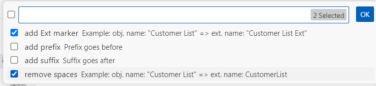
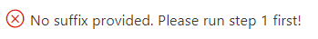

# project-setup README

The extension intended for basic project manipulation before manually resolving code problems.

## Features

This extension will help you to add Affix, rename extension objects, add ApplicationArea = All, resolve some breaking change errors. In general just to prepare your AL project for real upgrade.

## Requirements

Extension won't proparly work whithout "AL Language extension for Microsoft Dynamics 365 Business Central". 

⚠️ **Warning:** Always wait for "AL Language.." extension to load before running "Project Upgrade Preparation" extension commands!

## Extension commands

To see commands press _Ctrl + Shift + P_ and enter _SPLN:_

### Commands

* `SPLN: Prepare project for upgrade` - does several things: structurizes converted to AL files placed in the root of the project; adds "ApplicationArea = All" property to all relevant code parts; changes report layout paths; renames object extensions with objects name.
* `SPLN: General refactoring in active project` - resolves some common breaking change errors/warnings in the project files.
* `SPLN: General refactoring in active files` - resolves some common breaking change errors/warnings in only opened files.
* `SPLN: Add Suffix part 1` - adds Suffix to all relevant code parts and remembers Suffix value for father use.
* `SPLN: Add Suffix part 2. Resolve errors.` - adds Suffix to all objects and fields references with Suffix. 
* `SPLN: Add Suffix part 3. Clean up!` - clears Suffix where it is not needed. 
* `SPLN: Add Prefix part 1` - adds Prefix to all relevant code parts and remembers Prefix value for father use.
* `SPLN: Add Prefix part 2. Resolve errors.` - adds Prefix to all objects and fields references with Suffix. 
* `SPLN: Add Prefix part 3. Clean up!` - clears Prefix where it is not needed. 

### Commands explained

### SPLN: Prepare project for upgrade
---
⚠️ **Warning:** Before running the command make sure you structurized files yourself or put all the files into the root of the project.

Preparing the project consists of structurizing the files if they are not, adding ApplicationArea = All property, changing report layouts path and renaming extension objects.

The ApplicationArea property will be added to all custom page and pageextension fields, request page fields of reports and xmlports, and also to reports and pages that have UsageCategory property set. The property won't be added when the code part already has it.

To rename object extensions the system will ask you if you want to add affix to object extension name and if you want to add extension marker ("Ext.").

 

### SPLN: General refactoring in active project
---
For now this command resolves some simple breaking changes, like: 

* #### GetLanguageID error

| _Before_ | _After_ |
| --- | --- |
| _lrecLanguage: Record Language;_ | _lrecLanguage: Record Language;_   _`languageMgt: Codeunit Language;`_ |
| _`language.GetLanguageIdOrDefault`("Language Code");_ | _`languageMgt.GetLanguageIdOrDefault`("Language Code");_ |
 

* #### Cross-Reference replaced by Item Reference feature..

| Before | After |
| --- | --- |
| _field("Cross-Reference No."; Rec.`"Cross-Reference No."`)_ | _field("Cross-Reference No."; Rec.`"Item Reference No."`)_ |
| _field("Unit of Measure (Cross Ref.)"; `"Unit of Measure (Cross Ref.)"`)_ | _field("Unit of Measure (Cross Ref.)"; `"Item Reference Unit of Measure"`)_ |
 

* #### "Object" table error (only when target is Cloud)

| Before | After |
| --- | --- |
| _SourceTable = `"Object"`;_ | _SourceTable = `AllObjWithCaption`;_ |
| _field(ID; Rec.`ID`)_ | _field(ID; Rec.`"Object ID"`)_ |
 

* #### Scope property warning

| Before | After (_target - OnPrem_)| After (_target - Cloud_) |
| --- | --- | :---: |
| _[Scope(`'Internal'`)]_ | _[Scope(`'OnPrem'`)]_ | - |

 

### SPLN: General refactoring in active files
---
Does the same as `SPLN: General refactoring in active project`, but only for opened files.

 

### SPLN: Add Suffix part 1 & SPLN: Add Prefix part 1
---
Both commands work almost the same. 
At first you will be asked to enter affix.
Command will add provided affix to all object names, table extension fields and procedures, pageextension actions and procedures, report layouts.

⚠️ **Warning:** Command won't add affix to pageextension custom fields, this action does `SPLN: Add Suffix part 2. Resolve errors` and `SPLN: Add Prefix part 2. Resolve errors`.

💡 **Tip:** Before running this command would recommend to run first `AZ AL Dev Tools: Remove 'with' usage category from Active Project` or at least remove "NoImplicitWith" feature from manifest file (app.json) to make step 2 be more accurate in resolving erros.

📝 **Note:** Step 2 and step 3 commands can't be ran without step 1. Even if you already added affix and don't need step 1 run anyways to provide affix value to the system.

 

### SPLN: Add Suffix part 2. Resolve errors & SPLN: Add Prefix part 2. Resolve errors
---
Both commands work almost the same. 
Command will add affix in code where this errors appear: '..is missing..'; '..is not found in the target..'; '..does not contain a definition for..'; '..does not exist..'

⚠️ **Warning 1:** In every new VS Code session run step 1 first or you will receive an error. Step 1 not also adds affix, but remembers affix value for other commands. 
⚠️ **Warning 2:** Sometimes this command could mistakenly add affix to the code where errors appear because of the different reason than missing an affix. That's why after this command you need to run `SPLN: Add Suffix part 3. Clean up!` and `SPLN: Add Prefix part 3. Clean up!`.
⚠️ **Known issues:** Command do not cover: erors with non latin letters; errors in lines that dublicates in the file code; weird code syntax; files placed in the wrong spot; files having not a standard name.

_Error message:_

📝 **Note:** Almost always should be ran more than once!

 

### SPLN: Add Suffix part 3. Clean up! & SPLN: Add Prefix part 3. Clean up!
---
Both commands work almost the same. 
Command will remove affix from code where added affix din't resolve an error.

⚠️ **Warning:** In every new VS Code session run step 1 first or you will receive an error. Step 1 not also adds affix, but remembers affix value for other commands.

📝 **Note:** Almost always should be ran more than once!

After completing adding affix you will have to check for error about object which name is longer than 30 characters and change it manually by _right click -> Rename Symbol (F2)_. To make it easier in VS Code Problems section filter error with 'cannot exceed 30 characters' text.

_Filter errors:_

 

## Recommendations

* After running any command wait for the command response before doing something else.
* Read information messages and follow instructions.
* Use git commit before every command to be able to discard the changes in case you ran wrong command and mistaken your choices.

_"Discard All Changes" git command:_

